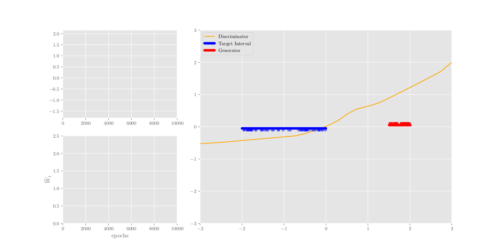
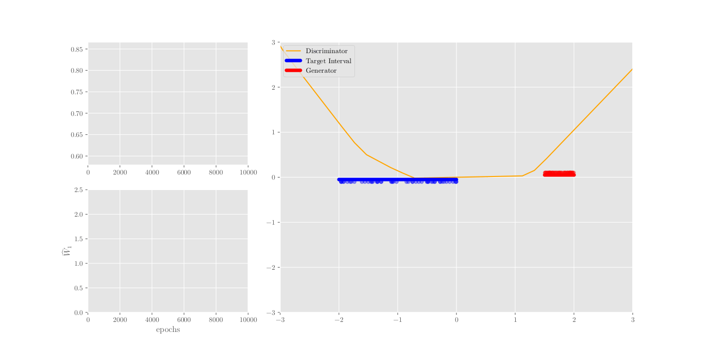
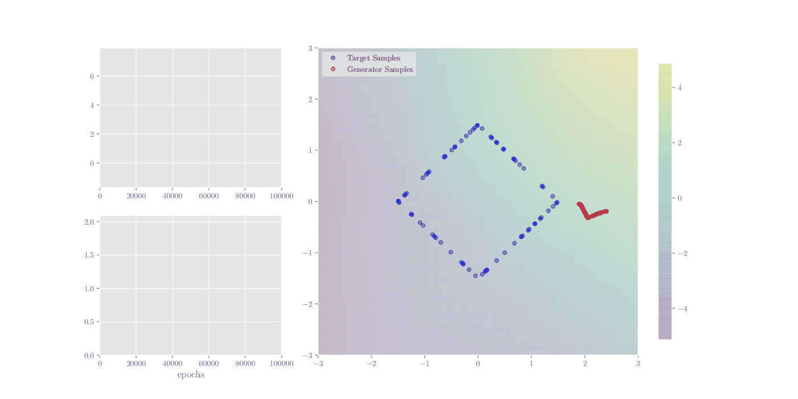
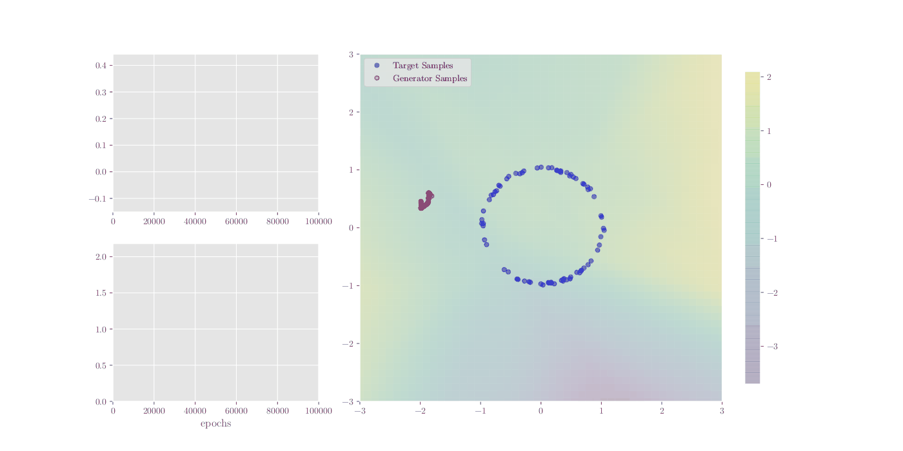
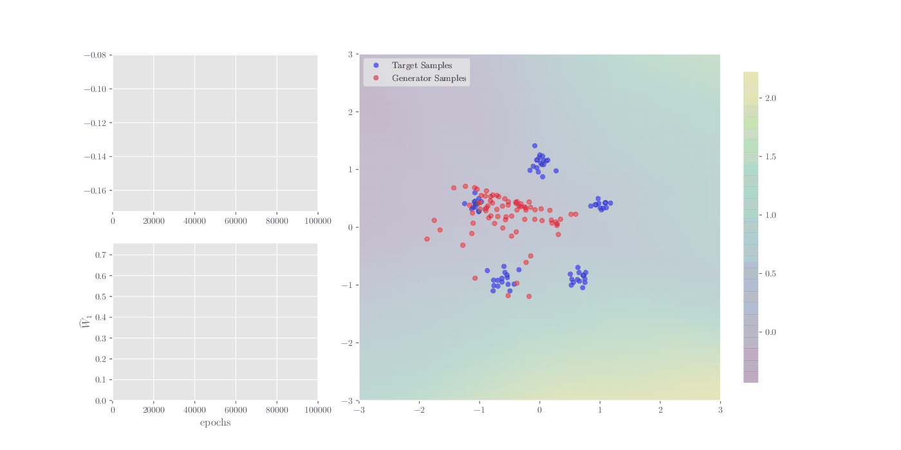

# GAN Convergence

Code for the experiments in "Convergence Properties of Generative Adversarial Networks".

We implemented the small-scale experiments in PyTorch (v1.8.1) to explore different techniques fostering GAN convergence. 
The code base covers different GAN objectives including non-saturating GAN, WGAN, WGAN-GP, WGAN-LP and WGAN with a simple gradient regularization.
The learning scenarios cover the DiracGAN, learning intervalls in 1D, different manifolds in 2D and mixture of Gaussians in 2D with respective visualizations.

## Usage
Specify the required parameters for each experiment (Dirac: `DiracGAN.py`, 1D: `GAN_1D.py`, 2D: `GAN_2D.py`) and select whether you want singleruns, multiruns or experiments (multiruns on all combinations of two parameter lists).

### Dirac GAN
Visualization of training a WGAN + simple Gradient Penalty in the DiracGAN setting.

**Upper left:** Wasserstein Distance (blue) between target distribution (Dirac at ) and generator distribution (Dirac at )
**Lower left:** Trajectories of Generator () and Discriminator () 
**Right:** Depiction of current learning progress

### 1D: Interval Learning
Learning of a uniform distribution with a shallow neural net as discriminator. Successful learning (simple gradient penalty) and failed learning (WGAN-GP).

  
  

### 2D: Manifold Learning

With `GAN_2D.py` learning of different manifolds  or a mixture of Gaussians

  
  
  

(Click to enlarge)
